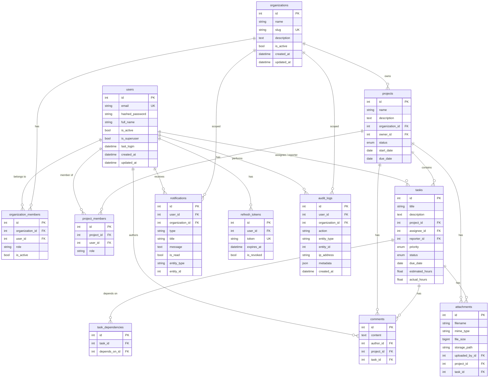

# Entity-Relationship Diagram

```mermaid
erDiagram
    users ||--o{ organization_members : "belongs to"
    users ||--o{ project_members : "member of"
    users ||--o{ tasks : "assignee / reporter"
    users ||--o{ comments : "authors"
    users ||--o{ notifications : "receives"
    users ||--o{ refresh_tokens : "has"
    users ||--o{ audit_logs : "performs"

    organizations ||--o{ organization_members : "has"
    organizations ||--o{ projects : "owns"
    organizations ||--o{ notifications : "scoped"
    organizations ||--o{ audit_logs : "scoped"

    projects ||--o{ project_members : "has"
    projects ||--o{ tasks : "contains"
    projects ||--o{ comments : "has"
    projects ||--o{ attachments : "has"

    tasks ||--o{ task_dependencies : "depends on"
    tasks ||--o{ comments : "has"
    tasks ||--o{ attachments : "has"

    users {
        int id PK
        string email UK
        string hashed_password
        string full_name
        bool is_active
        bool is_superuser
        datetime last_login
        datetime created_at
        datetime updated_at
    }

    organizations {
        int id PK
        string name
        string slug UK
        text description
        bool is_active
        datetime created_at
        datetime updated_at
    }

    organization_members {
        int id PK
        int organization_id FK
        int user_id FK
        string role
        bool is_active
    }

    projects {
        int id PK
        string name
        text description
        int organization_id FK
        int owner_id FK
        enum status
        date start_date
        date due_date
    }

    project_members {
        int id PK
        int project_id FK
        int user_id FK
        string role
    }

    tasks {
        int id PK
        string title
        text description
        int project_id FK
        int assignee_id FK
        int reporter_id FK
        enum priority
        enum status
        date due_date
        float estimated_hours
        float actual_hours
    }

    task_dependencies {
        int id PK
        int task_id FK
        int depends_on_id FK
    }

    comments {
        int id PK
        text content
        int author_id FK
        int project_id FK
        int task_id FK
    }

    attachments {
        int id PK
        string filename
        string mime_type
        bigint file_size
        string storage_path
        int uploaded_by_id FK
        int project_id FK
        int task_id FK
    }

    notifications {
        int id PK
        int user_id FK
        int organization_id FK
        string type
        string title
        text message
        bool is_read
        string entity_type
        int entity_id
    }

    audit_logs {
        int id PK
        int user_id FK
        int organization_id FK
        string action
        string entity_type
        int entity_id
        string ip_address
        json metadata
        datetime created_at
    }

    refresh_tokens {
        int id PK
        int user_id FK
        string token UK
        datetime expires_at
        bool is_revoked
    }
```
